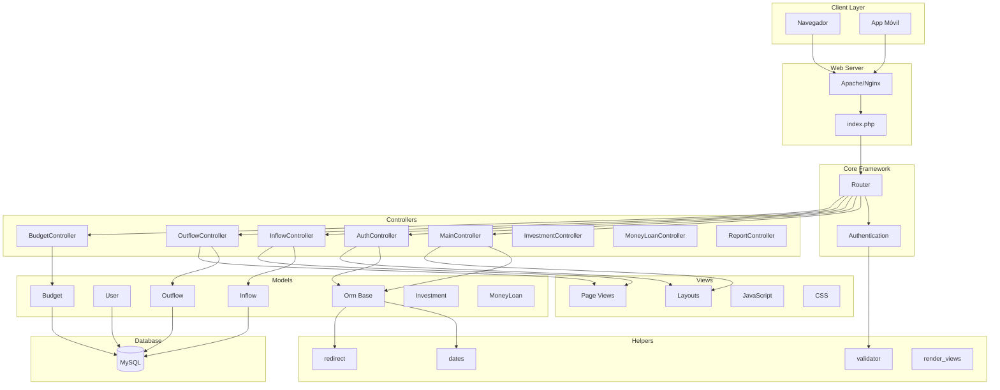

# Component Diagram - Manejo_Finanzas

---

## Componentes por capa

| Capa | Componentes |
|------|-------------|
| **Controllers** | Main, Auth, Inflow, Outflow, Budget, Investment, MoneyLoan, Report |
| **Models** | User, Inflow, Outflow, Budget, Investment, MoneyLoan, Category, Porcent |
| **Core** | Router, ORM, Authentication, Controller |
| **Helpers** | dates, redirect, validator, pagination, json, render_views |
| **Views** | layouts/, inflows/, outflows/, budgets/, investments/, loans/ |