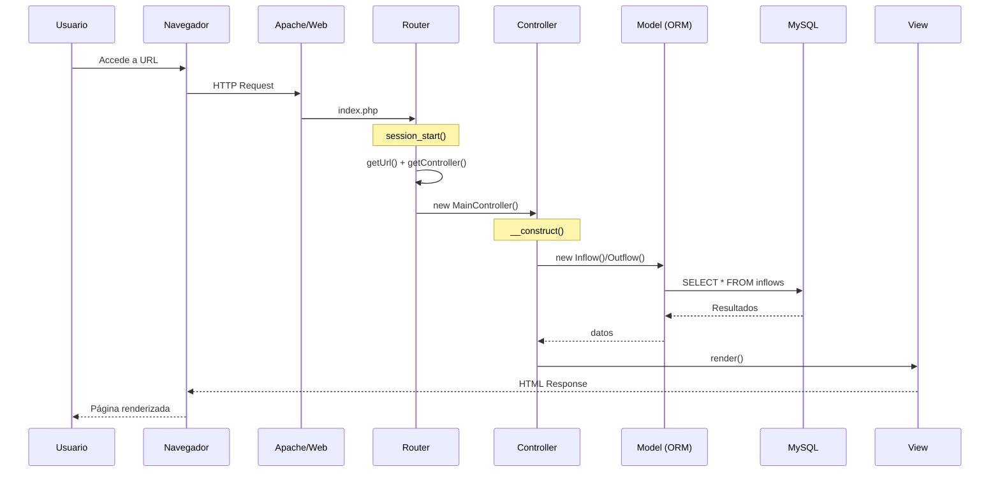
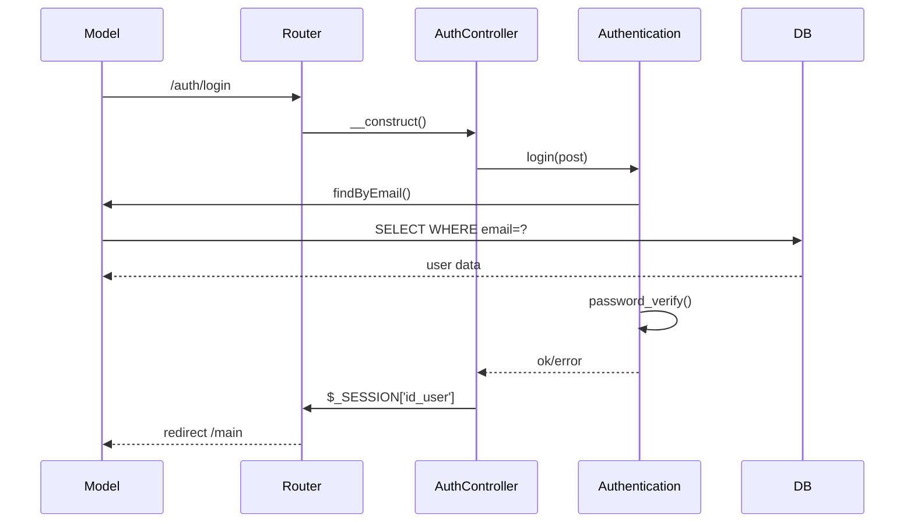
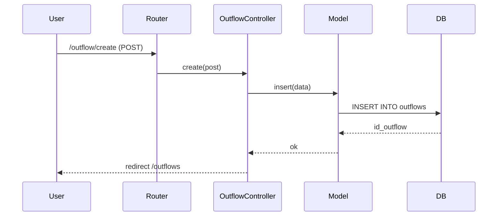

# Sequence Diagram - Manejo_Finanzas

## Flujo Principal: Request del usuario

## Flujo: Login

## Flujo: Registrar Egreso

---

## Resumen de componentes

| Componente | Rol |
|------------|-----|
| `index.php` | Entry point |
| `Router` | Parsea URL → controller/method |
| `Controller` | Lógica de negocio |
| `Model (Orm)` | Abstrae consultas SQL |
| `View` | Renderiza HTML |
| `Helper` | Utilidades (dates, redirect, etc) |